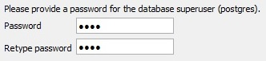
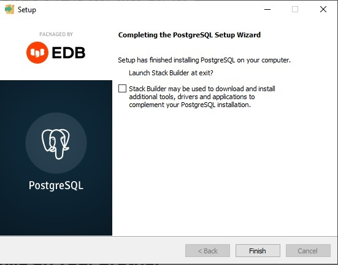
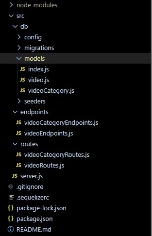

# **vechain server**

Date: november 2021

Author: Rafael Soteldo

Main technologies used:

-  Nodejs,
-  Express,
-  Sequelize-cli,
-  Sequelize Migrations,
-  Postgres

## **Installation guidelines**

-  `GIT Clone` the repo in your hard drive
-  `cd` to the created folder
-  `npm install` in order to install all dependencies
-  Install PostGreSQL 14 in your machine:
   -  Go to https://www.enterprisedb.com/downloads/postgres-postgresql-downloads in order to download the installer
   -  Run the installer,
   -  Click NEXT and leave the default values,
   -  When you get to the password, type `1234`, you can use another one if you want,
      <p align="center">
         
      </p>
   -  Click NEXT and leave the default values again, until you get to:
      <p align="center">
         
      </p>
   -  Leave `Stack Builder may...` off, you don't need it
   -  Click FINISH
-  Now PostGreSQL is installed.
-  For this demo to work, I have set some dummy data in PostGreSQL that we can see with the frontend.
-  But you don't need to do it yourself, that's the benefit of using `Sequelize Migrations`, I could code everything, from the database creation to the setting of data in it's tables,
-  You only need to excecute `npm run db:reset` in the project directory, it will automatically:

   -  Drop any previous `MadVikingGamesVideos` database in PostGreSQL
   -  Create a new database `MadVikingGamesVideos`
   -  Create the dummy data in the database tables
   -  The command db:reset is located in package.json, under `scripts`:

   ```jsx
   "scripts": {
    "start": "nodemon ./src/server.js",
    "db:reset": "npx sequelize-cli db:drop && npx sequelize-cli db:create && npx sequelize-cli db:migrate && npx sequelize-cli db:seed:all"
   },
   ```

   As you can see, it's still using nodemon, you can modify it and leave it as:

   ```jsx
   "start": "node ./src/server.js"
   ```

   In fact, I guess that you don't need nodemon

-  Now you can start the server `npm start` and wait for the message:

```jsx
app listening at port 3000
```

## **About the project**

This is the backend part of a complete vechain project

It saves the video info and videoCategories info into a local potgreSQL database.

The src folder contain most of the logic for the api, it is composed of:

<p align="center">
  
</p>

-  src folder, it contains most of the api logic
-  src/db folder, everything that's related to the DB definition
-  src/db/config/config.json, configuration file for the DB, it's in the .gitignore
-  src/db/migrations, these are script files that are used to create the DB
-  src/db/models, these are the files that contain the entities definitions
-  src/db/seeds, these are the files that contain the seed data, to fill the DB with initial data
-  src/endpoints folder, these files contain all the final endpoints of the api
-  src/routes, these files contain the routes to all the endpoint of the api
-  .sequelizerc
-  server.js

## **How the db folder was built by using sequelize-cli**

1. Initialized npm (nodejs program manager) and installed pg, sequelize and sequelize-cli.
2. Created and entered a db folder, and executed "npx sequelize-cli init"
3. Created a .sequelizerc that tells the sequelize scripts where the elements are
4. Used "npx sequelize-cli model:generate ..." to generate the models in src/db/models

For instance, for the video table, I excecuted

```jsx
// package.json
npx sequelize-cli model:generate --name User --attributes title:string,origin:string,uploadDate:string,url:string,excerpt:string,videoCategoryId:integer.
```

Then, I changed the resulting file to:

```jsx
// src/db/models/video.js
module.exports = (sequelize, DataTypes) => {
   const Video = sequelize.define(
      "Video",
      {
         title: DataTypes.STRING,
         origin: DataTypes.STRING,
         author: DataTypes.STRING,
         uploadDate: {
            type: DataTypes.DATE,
            defaultValue: DataTypes.NOW,
         },
         url: {
            type: DataTypes.STRING,
            unique: true,
            validate: {
               isUrl: true,
            },
         },
         excerpt: DataTypes.STRING,
         videoCategoryId: DataTypes.INTEGER,
      },
      {}
   );
   return Video;
};
```

Note that the uploadDate field has a preset value of `DataTypes.now`, and the url field has a predefined url validation.

5. Actually created the tables in Postgres issuing "npx sequelize-cli db:migrate"
6. Created empty seeders issuing "npx sequelize-cli seed:generate --name"
7. Replaced the empty seeders with the actual seed data

In our case, the seeds are:

```jsx
// src/db/seeders/20211128203434-Videos.js
module.exports = {
   up: (queryInterface, Sequelize) => {
      return queryInterface.bulkInsert(
         "Videos",
         [
            // title, origin, author, uploadDate, url, excerpt
            {
               // 1
               // Videos-1, 1
               title: "Vechain - Launch Film",
               origin: "Vimeo",
               author: "Rupert Cresswell",
               uploadDate: "2018/02/26",
               url: "https://vimeo.com/257581453",
               excerpt:
                  "The ‘VET Launch Film’, which debuted at VeChain Thor’s rebrand launch event in Singapore, breaks new ground as one of the world’s first brand campaigns for cryptocurrency. Created by MPC Creative with VFX by MPC, the film from agency Unconditioned Shanghai is set in a futuristic city that embodies the company’s vision; an inclusive blockchain platform that’s run by the people",
               videoCategoryId: 1,
               createdAt: new Date(),
               updatedAt: new Date(),
            },
            {
               // 2
               // Videos-1, 2
               title: "Vechain Opening (cut down)",
               origin: "Vimeo",
               author: "JIAQI",
               uploadDate: "2016/10/31",
               url: "https://vimeo.com/189652295",
               excerpt:
                  "Vechain is BlockChain Technology Protects Brands & Products",
               videoCategoryId: 1,
               createdAt: new Date(),
               updatedAt: new Date(),
            },
            {
               // 3
               // News-2, 1
               title: "Crypto News - VeChain Price Prediction VET prepares for a 26% climb - Bitcoin Price",
               origin: "Vimeo",
               author: "Free Stock Footage",
               uploadDate: "2021/04/27",
               url: "https://vimeo.com/542117939",
               excerpt:
                  "VeChain Price Prediction: VET prepares for 26% advance.",
               videoCategoryId: 2,
               createdAt: new Date(),
               updatedAt: new Date(),
            },

           ...

         ],
         {}
      );
   },
   down: (queryInterface, Sequelize) => {
      return queryInterface.bulkDelete("Videos", null, {});
   },
};
```

And:

```jsx
// src/db/seeders/20211128203402-VideoCategories.js
module.exports = {
   up: (queryInterface, Sequelize) => {
      return queryInterface.bulkInsert(
         "VideoCategories",
         [
            {
               name: "Videos",
               viewOrder: "1",
               createdAt: new Date(),
               updatedAt: new Date(),
            },
            {
               name: "News",
               viewOrder: "2",
               createdAt: new Date(),
               updatedAt: new Date(),
            },
            {
               name: "Definitions",
               viewOrder: "3",
               createdAt: new Date(),
               updatedAt: new Date(),
            },

            ...

         ],
         {}
      );
   },
   down: (queryInterface, Sequelize) => {
      return queryInterface.bulkDelete("VideoCategories", null, {});
   },
};
```

8. Created the associations by updating the created models with the entity associations.

The video model with the associations defined is:

```jsx
// src/db/models/video.js
module.exports = (sequelize, DataTypes) => {
   const Video = sequelize.define(
      "Video",
      {
         title: DataTypes.STRING,
         ...
      },
      {}
   );
   Video.associate = function (models) {
      Video.belongsTo(models.VideoCategory, {
         foreignKey: "videoCategoryId",
         onDelete: "CASCADE",
      });
   };
   return Video;
};
```

Means that each video belongs to one videoCategory, the foreign key will be videoCategoryId, and when a videoCategory is deleted, all the videos that belong to it are deleted too.

## <ins>**src/endpoints**</ins>

Define the endpoints of the api, for example, the videoEndpoints.js would be:

```jsx
// src/endpoints/videoEndpoints.js
const { VideoCategory, Video } = require('../db/models');
const Sequelize = require('sequelize');
const Op = Sequelize.Op;

const getAllVideos = async (req, res) => {
	try {
		const videos = await Video.findAll();
		if (!videos) return res.status(401).send('There are no videos');
		else return res.status(200).json({ videos });
	} catch (error) {
		return res.status(500).send(error.message);
	}
};
...
```

The order in which they are presented in the frontend is viewOrder

The way the user can modify this value, is with the `vechain-fron/src/redux/actions/categoriesActions.js`, specifically the functions `moveCategoryUp` and `moveCategoryDown`. These functions will execute the endpoints `moveVideoCategoryUpOneLevel` and `moveVideoCategoryDownOneLevel`:

Example:

```jsx
// src/endpoints/videoCategoryEndpoints.js
const moveVideoCategoryUpOneLevel = async (req, res) => {
   let name = req.params.categoryName;

   const videoCategory = await VideoCategory.findOne({ where: { name } });

   if (videoCategory) {
      const oldViewOrder = videoCategory.viewOrder;
      let newViewOrder = oldViewOrder - 1;
      if (!(newViewOrder < oldViewOrder))
         res.status(501).send(
            `${newViewOrder} is not less than ${oldViewOrder}`
         );
      await VideoCategory.update(
         // Setting the new value of viewOrder
         // It uses Sequelize.literal to add 1 to the previous value that it had
         { viewOrder: Sequelize.literal('"VideoCategories"."viewOrder" + 1') },
         {
            where: {
               viewOrder: {
                  [Op.between]: [newViewOrder, oldViewOrder],
               },
            },
         }
      );
      videoCategory.viewOrder = newViewOrder;
      await videoCategory.save();
      return res
         .status(200)
         .send(
            `Video Category successfully moved up to viewOrder ${newViewOrder}`
         );
   } else res.status(501).send(`Video Category ${name} doesn't exist`);
};
```

These endpoints will update the viewOrder to current value + 1 (down) or to current value - 1 (up)

Another thing to notice is that, in order to get only de categories that have videos, I have this endpoint:

```jsx
// src/endpoints/videoCategoryEndpoints.js
...
const getAllVideoCategoriesIncludingVideos = async (req, res) => {
   try {
      const videoCategories = await VideoCategory.findAll({
         include: [{ model: Video }],
         order: [["viewOrder", "ASC"]],
      });
      return res.status(200).json({ videoCategories });
   } catch (error) {
      console.log(error.message);
      return res.status(500).send(error.message);
   }
};
...
```

Which basically gets all categories with their videos, but I know that some categories will have the array of videos empty, so the frontend has to filter those categories out, in order to get only those categories that have videos.

```jsx
// vechain-front/src/redux/actions/categoriesActions.js
export function getOnlyVideoCategoriesThatHaveVideosWithTheirVideos() {
   return (dispatch) => {
      dispatch(getVideoCategoriesBegin);
      let apiUrl = "http://localhost:3000/api/v1/videoCategories/videos";
      axios
         .get(apiUrl)
         .then((res) => {
            // filter out empty categories
            let videoCategories = res.data.videoCategories.filter(
               (videoCategory) => videoCategory.Videos.length > 0
            );
            dispatch(getVideoCategoriesSuccess(videoCategories));
         })
         .catch((error) => {
            dispatch(setVideoCategoriesFailure(error));
         });
   };
}
```

## <ins>**src/routes**</ins>

Define the routes for every endpoint, for example, the `videoRoutes` would be:

```jsx
// src/routes/videoRoutes.js
const express = require("express");
const videoEndpoints = require("../endpoints/videoEndpoints");
const router = express.Router();

router.route("/title/:id").put(videoEndpoints.updateVideoTitle);
router.route("/origin/:id").put(videoEndpoints.updateVideoOrigin);
...

router.route("/").get(videoEndpoints.getAllVideos);

module.exports = router;
```

In this case, as the route for getAllVideos is just `/`, it has to be placed last

## <ins>.sequelizerc</ins>

This file is used by sequelize to locate the db definitions files, for example, I created an script in package.json called db:reset, which resets the entireb database, or creates it in case it doesn't exist in the postgres:

```jsx
// package.json
"scripts": {
   "start": "nodemon server.js",
   "db:reset": "npx sequelize-cli db:drop && npx sequelize-cli db:create && npx sequelize-cli db:migrate && npx sequelize-cli db:seed:all"
},
```

Without this .sequelizerc this script wouldn't work

## <ins>server.js</ins>

It simply puts everything toguether:

```jsx
// server.js
require("dotenv").config();
const express = require("express");
const cors = require("cors");
const videoRoutes = require("./src/routes/videoRoutes");
const videoCategoryRoutes = require("./src/routes/videoCategoryRoutes");
const logger = require("morgan");

const app = express();
const port = 3000;

app.use(cors());

app.use(express.json());
app.use(express.urlencoded());
app.use(logger("tiny"));

app.use("/api/v1/videos", videoRoutes);
app.use("/api/v1/videoCategories", videoCategoryRoutes);

app.listen(port, () => console.log(`app listening at port ${port}`));
```

Middlewares:

-  express.json() to parse the body of the request,
-  cors() to allow cross origin requests from the front end, and
-  logger() to log the requests, of course, we have to make sure that this setting is used in development only

Routes as middlewares

-  app.use("/api/v1/videos", videoRoutes);
-  app.use("/api/v1/videoCategories", videoCategoryRoutes);

Finally, listen the port 3000 for incoming requests
